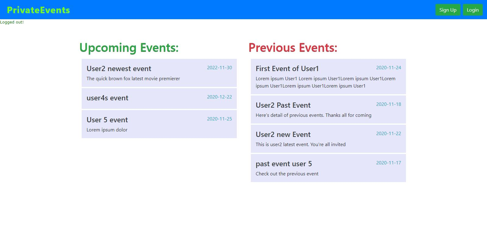
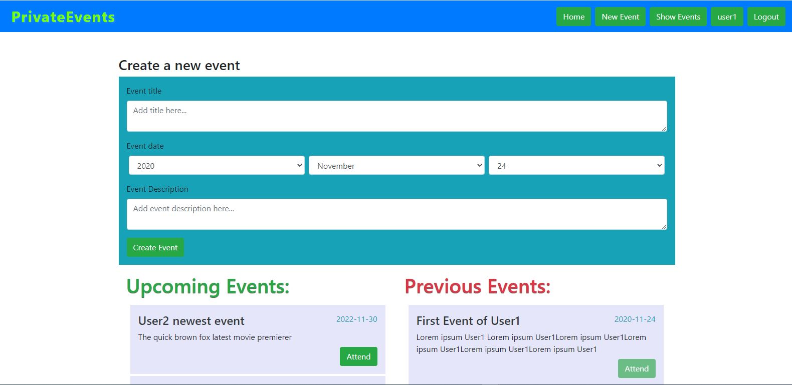

# RailsForm

> This project is part of Microverse HTML/CSS Ruby on Rails module

## The Odin Project: RoR Associations project (Private Event)

This project is a simple site whereby users can sign-up and then create an event. Other sign-up users can see all events (Past and Upcoming) and accept invitation to any upcoming event. This project demonstrates the application of Ruby on Rails Association and Active Record concept. See project [Live demo](https://git.heroku.com/nameless-peak-10668.git).

| |
|:-------------------------:|
|   Home Page |   LoggedIn User |

## Setup Instructions & Getting Started

- [Clone](https://github.com/rloterh/PrivateEvents.git) this project
- Install dependencies using the command **_bundle install_**
- Run the command **_rails db:create_** to create database
- Run the command **_rails db:migrate_** to configure database schema
- Run the command **_rails s_** to start the Rails server
- In your browser, navigate to  **_http://localhost:3000**
  

## Built Mainly With

- Ruby 2.7.2
- Rails 6.0.3.4
- Simple Forms 5.0.3

## Authors
👤 **Robert Loterh**

- Github: [@githubhandle](https://github.com/rloterh)
- Twitter: [@twitterhandle](https://twitter.com/RLoterh )
- Linkedin: [linkedin](https://www.linkedin.com/in/robert-loterh)

## 🤝 Contributing

Contributions, issues and feature requests are welcome!

Feel free to check the [issues page](https://github.com/rloterh/PrivateEvents/issues).

## Show your support

Give a ⭐️ if you like this project!

## Acknowledgments

- Project requirements created by [Odin Project](https://www.theodinproject.com/)

## 📝 License

This project is [MIT](lic.url) licensed.
